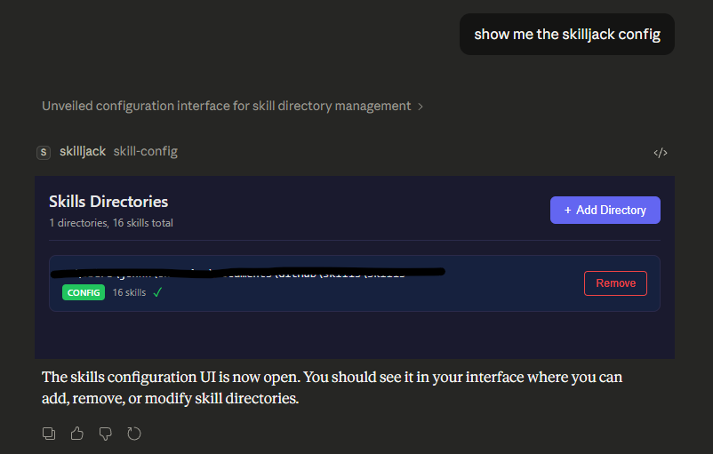
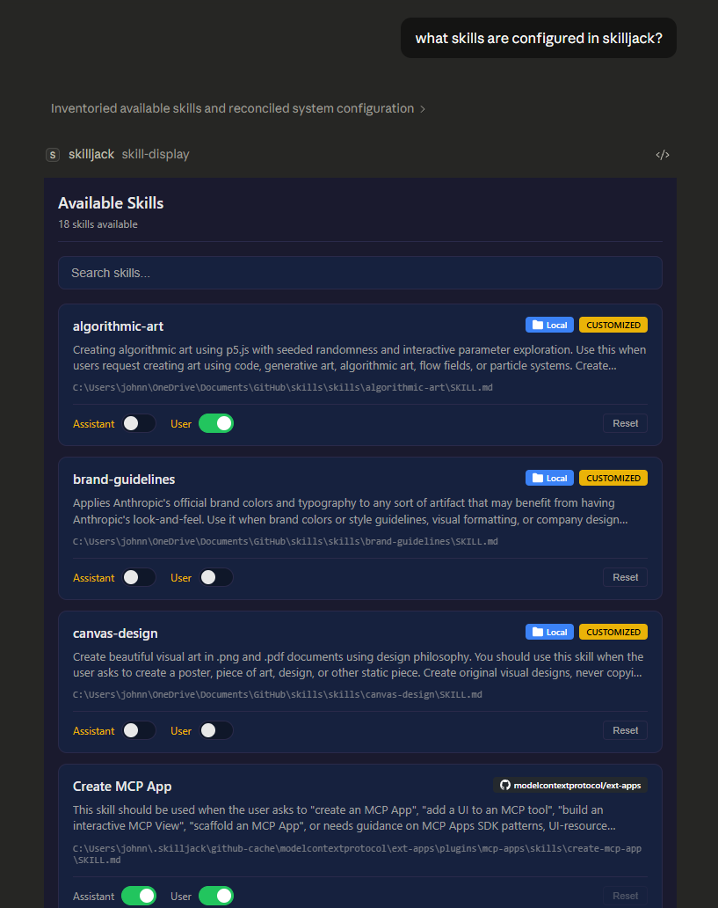

# Skilljack MCP

An MCP server that jacks [Agent Skills](https://agentskills.io) directly into your LLM's brain.

## Installation

```bash
npm install @skilljack/mcp
```

Or run directly with npx:

```bash
npx @skilljack/mcp /path/to/skills
```

### From Source

```bash
git clone https://github.com/olaservo/skilljack-mcp.git
cd skilljack-mcp
npm install
npm run build
```

## Usage

```bash
# Single directory
skilljack-mcp /path/to/skills

# Multiple directories
skilljack-mcp /path/to/skills /path/to/more/skills

# Using environment variable
SKILLS_DIR=/path/to/skills skilljack-mcp

# Static mode (no file watching)
skilljack-mcp --static /path/to/skills
```

## Configuration UI



## Skill Display UI



## Documentation

For complete documentation, just ask your assistant:

> "load the skilljack docs"

This loads the full reference including tools, prompts, resources, configuration options, and architecture details.

## Related

- [Agent Skills Specification](https://agentskills.io)
- [MCP TypeScript SDK](https://github.com/modelcontextprotocol/typescript-sdk)
- [Example MCP Clients](https://modelcontextprotocol.io/clients)
